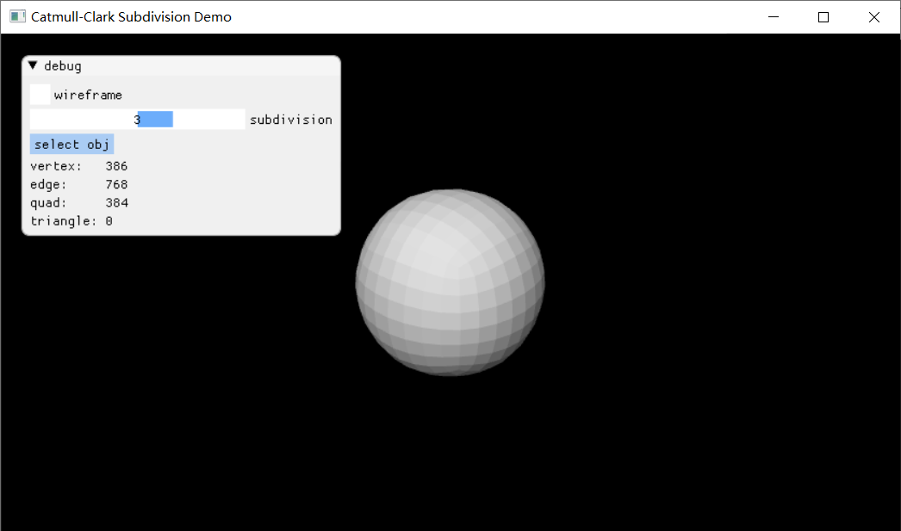
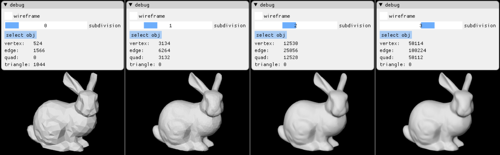
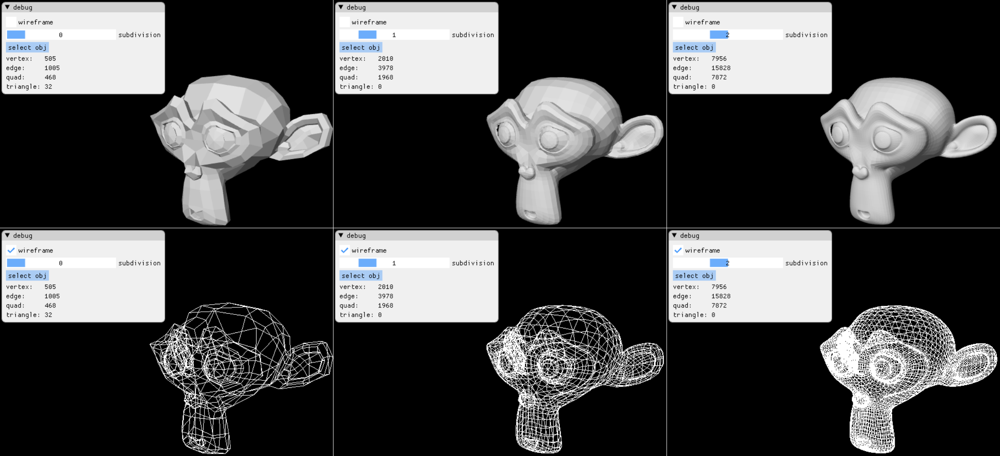

# GM Project

## 编译

项目使用`Win32 API`和`DirectX 11`来将细分结果显示在窗口中，因此只能在Windows平台上编译运行。此外，项目使用了许多`C++17`特性，故需用版本较新的编译器（如`VS2017`或`VS2019`）。所有依赖项均已放置在`./lib`目录下，直接使用`cmake`构建解决方案文件即可：

```powershell
cd project_source_dir
mkdir build
cd build
cmake -G "Visual Studio 16 2019" ..
```

## 文件结构

| 路径          | 含义                                                   |
| ------------- | ------------------------------------------------------ |
| lib/agz-utils | 自己维护的一些图形学工具，提供数学运算、模型加载等功能 |
| include       | demo头文件                                             |
| src           | demo源文件                                             |

## 算法简述

### 基本步骤

本demo实现了朴素的Catmull-Clark网格细分算法，可以划分由三角形和四边形构成的模型。算法描述如下：

* 输入：顶点位置数组，面数组，其中每个面用三个或四个顶点下标构成
* 输出：细分后的顶点位置数组与面数组

1. 整理点边面间的拓扑关系，合并处于同一位置的顶点，初始化如下映射：

   * 顶点 -> 包含该顶点的边构成的集合
   * 顶点 -> 包含该顶点的面构成的集合
   * 边 -> 该边的两个顶点
   * 边 -> 包含该边的面构成的集合
   * 面 -> 该面的所有顶点
   * 面 -> 该面的所有边

   其具体的数据结构如下：

   ```cpp
   struct VertexRecord
   {
       Vec3 position;
       std::vector<int> edges; // 包含该顶点的边
       std::vector<int> faces; // 包含该顶点的面
   };
   
   struct EdgeRecord
   {
       int lowVertex  = -1;         // 下标值较小的那个顶点
       int highVertex = -1;         // 下标值较大的那个顶点
       int faceCount  = 0;          // 属于多少个面
       int faces[2]   = { -1, -1 }; // 包含该边的面
   };
   
   struct FaceRecord
   {
       bool isQuad = false;
       int vertices[4] = { -1, -1, -1, -1 };
       int edges   [4] = { -1, -1, -1, -1 };
   };
   
   struct Model
   {
       std::vector<VertexRecord> vertices;
       std::vector<EdgeRecord>   edges;
       std::vector<FaceRecord>   faces;
   
       std::unordered_map<Vec3, int>  positionToVertex;
       std::unordered_map<Vec2i, int> vertexPairToEdge;
   };
   ```

2. 对每个面$f$，设$V[f]$是面$f$的所有顶点，令：
   $$
   \mathrm{facePoint}[f] \leftarrow \frac 1 {|V[f]|} \sum_{v \in V[f]}v
   $$

3. 对每条边$e$，令：
   $$
   \mathrm{edgePoint}[e] \leftarrow 0.25 \times (e.v_0 + e.v_1 + \mathrm{facePoints}[e.f_0] + \mathrm{facePoints}[e.f_1])
   $$

4. 对每个顶点，设$F[v]$是包含该顶点的所有面，$E[v]$是包含该顶点的所有边，令：
   $$
   v \leftarrow \frac{|F[v]| - 3}{|F[v]|}v + \frac{1}{2|F[v]||E[v]|}\sum_{e \in E[v]}(e.v_0 + e.v_1) + \frac{2}{|F[v]|^2}\sum_{f \in F[v]}\mathrm{facePoint}[f]
   $$
   
5. 将原模型中由顶点$v_0, v_1, \ldots, v_{n-1}$构成的$n$边形替换为以下$n$个四边形：

$$
\begin{matrix}
\mathrm{edgePoint}[v_{n-1}v_0] & v_0 & \mathrm{edgePoint}[v_0v_1] & \mathrm{facePoint}[v_0\ldots v_{n-1}] \\
\mathrm{edgePoint}[v_0v_1] & v_1 & \mathrm{edgePoint}[v_1v_2] & \mathrm{facePoint}[v_0\ldots v_{n-1}] \\
& \cdots & \cdots & \\
\mathrm{edgePoint}[v_{n-2}v_{n-1}] & v_{n-1} & \mathrm{edgePoint}[v_{n-1}v_0] & \mathrm{facePoint}[v_0\ldots v_{n-1}]
\end{matrix}
$$

可以在一个模型上重复运行多次细分算法，直到达到需要的精细、平滑程度为止。

### 特殊情形

1. 有的模型包含所谓的“孔洞”，孔洞边缘的边只属于一个面，顶点所属于的边数和面数也会不相等。对孔洞边缘的边$e$，令：

$$
\mathrm{edgePoint}[e] \leftarrow 0.5 \times (e.v_0 + e.v_1)
$$
2. Catmull-Clark算法并不保证生成的四边形的四个顶点严格位于同一平面上，在绘制时我将所有的四边形拆分为两个三角形，并令其法线为两个三角形法线的平均。

## 运行结果

程序的默认启动路径为项目根目录，启动后自动加载`./asset/cube.obj`文件，这是一个立方体模型。拖动界面上的`subdivision`小滑块可以调整细分次数；按住鼠标中键并拖动可以调整摄像机位置，滑动鼠标滚轮则可以调整摄像机和物体间的距离；在调整摄像机位置时，光照方向也会自动根据摄像机位置变化，使得无论在哪个视角都能照亮物体的表面。



点击界面上的`select obj`按钮，可以选择加载其他的obj模型。所有加载的模型都会被自动平移至坐标原点，且缩放至单位立方体的大小，方便观察。下图是加载并细分一个粗糙的兔子模型的结果：



此外，点击界面上的`wireframe`按钮，可以以线框模式查看模型。下图为以实体/线框模式查看一个猴头模型的效果：



## 性能测试

实验配置：

```
Intel i5-8300H
DDR4 双通道16GB
```

对每个模型以及每个迭代次数，算法被重复调用500次后计算了平均时长。

立方体细分测试：

| 细分次数 | 图元数量 | 算法耗时 (ms) |
| -------- | -------- | ------------- |
| 0        | 6 * quad | 0.000         |
| 1        | 24       | 0.022         |
| 2        | 96       | 0.100         |
| 3        | 384      | 0.226         |
| 4        | 1536     | 0.942         |
| 5        | 6144     | 3.386         |

猴头细分测试：

| 细分次数 | 图元数量              | 算法耗时 (ms) |
| -------- | --------------------- | ------------- |
| 0        | 468 * quad + 32 * tri | 0.000         |
| 1        | 1968                  | 0.932         |
| 2        | 7872                  | 4.457         |
| 3        | 31488                 | 18.053        |
| 4        | 125952                | 84.989        |
| 5        | 503808                | 449.955       |

每次细分都会将一个四边形变成四个四边形、将一个三角形变成三个三角形，而第一轮细分后模型上就没有三角形了。设模型中边数为$E$，顶点数为$V$，面数为$F$，则算法的时间复杂度为：
$$
\Theta(F) + \Theta(F) + \Theta(E) + \Theta(V) + O(F) = \Theta(F)
$$
上式左边的每一项分别代表收集拓扑信息的时长，计算$\mathrm{facePoint}$的时长，计算$\mathrm{edgePoint}$的时长，更新顶点位置的时长，以及产生新面的时长。由上式可见，算法的耗时大致与图元数量$F$呈正比，这也被实验数据所验证了。

